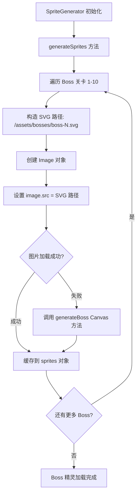
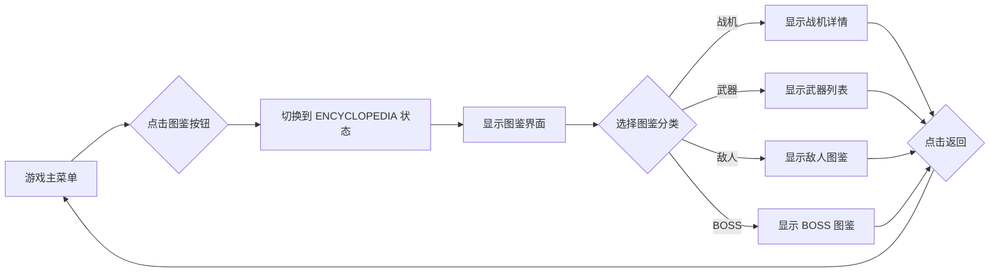
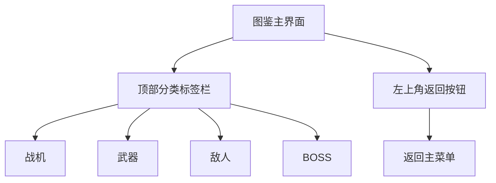

# Boss SVG 化设计文档

## 一、设计概述

本设计文档旨在将 Boss 外观生成系统从现有的 Canvas 绘制方式转换为 SVG 静态资源文件，通过动态加载 SVG 文件替代硬编码绘制逻辑。

### 设计目标

- 将现有 Boss Canvas 绘制代码转换为独立的 SVG 文件
- 实现 SVG 文件的动态加载机制
- 保持 Boss 外观视觉效果与现有实现一致
- 提升 Boss 外观的可维护性和可编辑性

### 适用范围

本设计适用于 Neon Raiden 游戏项目的以下模块：
- Boss 视觉表现系统（SpriteGenerator.ts、RenderSystem.ts）
- Boss 精灵资源管理（SpriteMap）

---

## 二、Boss 外观 SVG 化设计

### 2.1 需求分析

当前系统现状：
- Boss 外观在 SpriteGenerator.ts 的 generateBoss 方法中通过 Canvas API 绘制
- 共有10个关卡的 Boss，每个 Boss 外观通过 level 参数区分
- Boss 精灵在游戏初始化时生成并缓存到 SpriteMap 中
- 现有 Boss 外观包含主体、装甲、武器、发光效果等视觉元素

改进方向：
- 将每个 Boss 的 Canvas 绘制逻辑转换为等效的 SVG 文件
- 保持 SVG 视觉效果与现有 Canvas 绘制一致
- 在游戏启动时动态加载 SVG 文件替代 Canvas 生成

### 2.2 SVG 资源结构设计

#### 2.2.1 目录结构

在项目中新增 `public/assets/bosses/` 目录，存放 Boss SVG 文件：

```
public/
  assets/
    bosses/
      boss-1.svg      # 第1关 Boss：无人机母舰
      boss-2.svg      # 第2关 Boss：突击巡洋舰
      boss-3.svg      # 第3关 Boss：重型战列舰
      boss-4.svg      # 第4关 Boss：隐形战机
      boss-5.svg      # 第5关 Boss：能量要塞
      boss-6.svg      # 第6关 Boss：双子舰
      boss-7.svg      # 第7关 Boss：三角要塞
      boss-8.svg      # 第8关 Boss：蛛型机甲
      boss-9.svg      # 第9关 Boss：环形核心
      boss-10.svg     # 第10关 Boss：最终恶魔
```

#### 2.2.2 SVG 文件规范

每个 SVG 文件应遵循以下设计规范：

| 规范项 | 要求说明 |
|--------|----------|
| 画布尺寸 | 基础尺寸：160px + (level × 20)px，例如关卡1为180×180，关卡10为360×360 |
| 坐标系统 | SVG viewBox 设置为 "-尺寸/2 -尺寸/2 尺寸 尺寸"，使中心点为原点 |
| 旋转方向 | 所有元素默认旋转180度（`transform="rotate(180)"`），因为游戏中 Boss 朝下飞行 |
| 颜色保留 | 严格复用现有 Canvas 代码中的颜色值，保持视觉一致性 |
| 发光效果 | 使用 `<filter>` 标签的 `feGaussianBlur` 实现 `shadowBlur` 效果 |
| 分组结构 | 使用 `<g>` 标签分组，但不强制要求，优先保证视觉还原度 |

#### 2.2.3 Canvas 到 SVG 转换映射

将现有 Canvas API 转换为 SVG 元素的对应关系：

| Canvas API | SVG 元素 | 说明 |
|-----------|---------|------|
| `ctx.fillStyle` | `fill="颜色"` | 填充颜色 |
| `ctx.strokeStyle` | `stroke="颜色"` | 描边颜色 |
| `ctx.lineWidth` | `stroke-width="数值"` | 描边宽度 |
| `ctx.fillRect(x, y, w, h)` | `<rect x="x" y="y" width="w" height="h" />` | 矩形 |
| `ctx.arc(x, y, r, 0, 2π)` | `<circle cx="x" cy="y" r="r" />` | 圆形 |
| `ctx.beginPath()` + `ctx.lineTo()` | `<path d="M x y L x y ..." />` | 路径 |
| `ctx.shadowBlur` + `ctx.shadowColor` | `<filter><feGaussianBlur /></filter>` | 发光效果 |
| `ctx.rotate(angle)` | `transform="rotate(角度)"` | 旋转 |
| `ctx.translate(x, y)` | `transform="translate(x, y)"` | 平移 |

### 2.3 SVG 加载机制设计

#### 2.3.1 加载时机与策略

SVG 资源加载在 SpriteGenerator 初始化阶段完成：

| 阶段 | 加载策略 | 说明 |
|------|----------|------|
| SpriteGenerator 构造函数 | 同步或异步预加载全部 Boss SVG | 在 generateSprites 中加载 |
| 资源转换 | 将 SVG 文件转换为 HTMLImageElement | 与现有 Canvas 生成的精灵保持相同类型 |
| 缓存机制 | 存储到 sprites 对象中，key 为 `boss_${level}` | 与现有命名规范一致 |
| 错误处理 | SVG 加载失败时保留 Canvas 绘制作为降级方案 | 确保游戏可用性 |

#### 2.3.2 加载流程

SVG 加载流程设计如下：



#### 2.3.3 实现要点

在 SpriteGenerator 中实现 SVG 加载的关键点：

| 实现要点 | 说明 |
|---------|------|
| 图片加载方式 | 直接使用 `new Image()` + `image.src = SVG路径`，利用浏览器原生 SVG 支持 |
| 同步/异步 | 可使用 Promise.all 等待所有 Boss 图片加载，或简单直接赋值（浏览器异步加载） |
| 降级策略 | 监听 `image.onerror` 事件，失败时调用原有 `generateBoss(level)` 方法 |
| 缓存键名 | 保持 `boss_${level}` 格式，与现有 RenderSystem 兼容 |

### 2.4 SVG 文件转换示例

#### 2.4.1 第1关 Boss（无人机母舰）转换示例

现有 Canvas 代码片段（SpriteGenerator.ts 265-296行）：

关键绘制逻辑：
- 主船体：深蓝色多边形，坐标为 (-50,-30) (50,-30) (60,30) (-60,30)
- 装甲板：深灰色矩形，-40到40宽度，-20到20高度
- 无人机舱：3个青色矩形，宽10高20，位置在 x=-25/0/25
- 能量核心：青色圆形，半径12，带发光效果

转换为 SVG 的结构（自然语言描述）：
- 使用 `<defs>` 定义发光滤镜，id="glow"，`feGaussianBlur` stdDeviation=15
- 船体使用 `<polygon>` 元素，points="-50,-30 50,-30 60,30 -60,30"，fill="#1a365d"
- 装甲板使用 `<rect>` 元素，x=-40 y=-20 width=80 height=40，fill="#2d3748"
- 三个舱室使用三个 `<rect>` 元素，fill="#3182ce"
- 核心使用 `<circle>` 元素，cx=0 cy=0 r=12，fill="#63b3ed"，filter="url(#glow)"
- 整体外层包裹 `<g transform="rotate(180)">` 实现180度旋转

#### 2.4.2 第8关 Boss（蛛型机甲）转换示例

现有 Canvas 代码片段（SpriteGenerator.ts 573-616行）：

关键绘制逻辑：
- 外层装甲：紫色圆形，半径35
- 8条激光腿：循环生成，起点半径45，终点半径90，紫色描边，宽度10，带发光
- 腿部关节：8个紫色圆形，半径8，位置在每条腿的终点
- 核心眼睛：红色圆形，半径18，强发光效果（blur=20）

转换为 SVG 的结构（自然语言描述）：
- 定义紫色发光滤镜（blur=12）和红色发光滤镜（blur=20）
- 使用 `<circle>` 绘制装甲层
- 使用8个 `<line>` 元素绘制激光腿，配合计算的角度位置
- 使用8个 `<circle>` 元素绘制关节
- 使用 `<circle>` 绘制核心眼睛，应用红色发光滤镜
- 整体旋转180度

#### 2.4.3 颜色和效果保真度要求

转换时必须严格遵循的原则：

| 要求项 | 说明 |
|--------|------|
| 颜色值保留 | 必须使用 Canvas 代码中的原始颜色值，不得修改 |
| 发光强度 | shadowBlur 值直接映射为 feGaussianBlur 的 stdDeviation |
| 尺寸精确 | 所有坐标、半径、宽高必须与 Canvas 代码完全一致 |
| 层次顺序 | SVG 元素的绘制顺序必须与 Canvas 代码的绘制顺序一致 |
| 旋转处理 | 统一在最外层添加 rotate(180) 而非修改坐标系统 |

### 2.5 降级与兼容性设计

为保证系统平滑过渡和稳定性：

| 场景 | 处理方式 |
|------|----------|
| SVG 文件缺失或加载失败 | 自动回退到原有 generateBoss Canvas 绘制逻辑 |
| 浏览器不支持 SVG | Image 加载失败时自动降级，无需手动检测 |
| 渐进式迁移 | 可优先创建部分 Boss 的 SVG，其余保留 Canvas 生成 |
| 原有代码保留 | 暂不删除 generateBoss 方法，作为降级和参考依据 |

---

## 三、实施步骤

### 3.1 转换工作流程

Boss SVG 化的实施步骤：

| 步骤 | 任务内容 | 输出物 |
|------|---------|--------|
| 步骤1 | 创建 SVG 文件目录结构 | public/assets/bosses/ 目录 |
| 步骤2 | 逐个转换 Boss Canvas 代码为 SVG | 10个 SVG 文件（boss-1.svg 到 boss-10.svg） |
| 步骤3 | 修改 SpriteGenerator 加载逻辑 | 更新 generateSprites 方法 |
| 步骤4 | 测试每个 Boss 视觉效果 | 验证视觉一致性 |
| 步骤5 | 调整 SVG 细节以匹配原效果 | 优化后的 SVG 文件 |

### 3.2 图鉴界面入口设计

#### 3.2.1 入口位置

在游戏主菜单（MENU 状态）中新增"图鉴"按钮，位置布局如下：

| UI 元素 | 位置 | 样式描述 |
|---------|------|----------|
| 标题区域 | 屏幕中央上方 | "NEON RAIDEN" 大标题，青色渐变 |
| 开始按钮 | 标题下方，中央位置 | "START MISSION" 按钮，青色主题 |
| 图鉴按钮 | 开始按钮下方 | "ENCYCLOPEDIA" 按钮，紫色主题 |
| 版本信息 | 屏幕右下角 | 小号文字，半透明显示 |

#### 3.2.2 交互流程



### 3.3 图鉴内容设计

#### 3.3.1 战机展示模块

战机展示模块设计目标：
- 展示玩家战机的外观和属性
- 提供战机升级路线说明（未来扩展）

展示内容：

| 展示项 | 内容说明 |
|--------|----------|
| 战机模型 | 使用玩家精灵图，支持360度旋转查看（可选） |
| 基础属性 | HP、移动速度、碰撞箱大小 |
| 特殊能力 | 护盾系统、僚机系统、炸弹系统 |
| 解锁状态 | 默认战机始终解锁 |

属性数据表格：

| 属性名称 | 数值 | 说明 |
|---------|------|------|
| 生命值 | 100 | 初始 HP |
| 最大护盾 | 50 | 护盾上限 |
| 移动速度 | 7 | 像素/帧 |
| 碰撞箱尺寸 | 48×48 | 宽×高（像素） |
| 初始炸弹数 | 3 | 游戏开始时的炸弹数量 |
| 最大僚机数 | 3 | 僚机上限 |

#### 3.3.2 武器库模块

武器库展示所有8种武器的详细信息。

展示布局：
- 网格布局，每行展示2-3个武器
- 每个武器卡片包含图标、名称、等级进度条、属性数据

武器卡片内容：

| 展示项 | 内容说明 |
|--------|----------|
| 武器图标 | 使用武器子弹精灵图，放大展示 |
| 武器名称 | 中文名称，如"散弹炮"、"激光" |
| 代号标识 | 英文代号，如 V、L、M、W、X、T、F、S |
| 最高等级 | 显示当前玩家已达到的最高等级（1-10） |
| 基础伤害 | 1级时的伤害值 |
| 射速 | 发射间隔（毫秒） |
| 特性标签 | "穿透"、"追踪"、"范围爆炸"等 |
| 升级效果 | 简要描述升级后的变化 |

武器数据表格示例（VULCAN 散弹）：

| 属性 | 数值 |
|------|------|
| 名称 | 散弹炮 |
| 代号 | V |
| 颜色 | 黄色 |
| 基础伤害 | 10 |
| 等级伤害递增 | +3 每级 |
| 射速（1级） | 100ms |
| 射速（10级） | 80ms |
| 子弹数量 | 1 → 3 → 5 → 7（随等级递增） |
| 特性 | 扇形覆盖，数量型武器 |

解锁状态：
- 玩家拾取过的武器标记为已解锁
- 未拾取的武器显示为灰色，提示"未获得"

#### 3.3.3 小怪图鉴模块

小怪图鉴展示7种普通敌人的详细信息。

展示布局：
- 列表布局，每个敌人占据一行
- 点击展开详细信息面板

敌人卡片内容：

| 展示项 | 内容说明 |
|--------|----------|
| 敌人模型 | 使用敌人精灵图 |
| 编号与名称 | 如"#0 Scout（侦察机）" |
| 外观特征 | "红色无人机" |
| 基础 HP | 20（1级） |
| 移动速度 | 2（基础速度） |
| 行为模式 | "缓慢直线飞行，偶尔发射子弹" |
| 出现关卡 | "1-10关" |
| 得分奖励 | 100 分 |
| 精英形态 | 展示精英版外观（金色光芒） |

敌人数据表格示例（Scout）：

| 属性 | 数值 |
|------|------|
| ID | 0 |
| 名称 | Scout（侦察机） |
| 外观 | 红色无人机 |
| 基础 HP | 20 |
| HP 成长 | +10 每关 |
| 基础速度 | 2.0 |
| 速度成长 | +0.5 每关 |
| 碰撞箱 | 40×40 |
| 行为模式 | 直线飞行，低频射击 |
| 首次出现 | 第1关 |

解锁条件：
- 击败该类型敌人至少1次后解锁
- 未解锁时显示为黑色剪影，提示"???"

#### 3.3.4 BOSS 图鉴模块

BOSS 图鉴展示10关 Boss 的详细信息。

展示布局：
- 横向滑动卡片，每张卡片展示一个 Boss
- 支持左右滑动切换 Boss

BOSS 卡片内容：

| 展示项 | 内容说明 |
|--------|----------|
| Boss 外观 | 使用 SVG 或精灵图，大尺寸展示 |
| 关卡与名称 | 如"STAGE 1: Drone Carrier（无人机母舰）" |
| Boss 描述 | "蓝色母舰，带有发光的无人机舱室和能量核心" |
| 基础属性 | HP、移动速度、尺寸倍率 |
| 武器系统 | 列出所有武器系统的名称和类型 |
| 攻击模式 | "环形弹幕"、"激光扫射"等 |
| 移动模式 | "正弦波动"、"追踪模式"等 |
| 弱点提示 | "避开环形弹幕，靠近攻击核心" |
| 击败奖励 | 得分奖励 |

BOSS 数据表格示例（第1关 Boss）：

| 属性 | 数值 |
|------|------|
| 关卡 | 1 |
| 名称 | Drone Carrier（无人机母舰） |
| HP | 1,500 |
| 移动速度 | 1.0 |
| 尺寸倍率 | 0.8 |
| 武器数量 | 1（环形弹幕） |
| 子弹数量 | 8 发/次 |
| 子弹速度 | 4.0 |
| 开火频率 | 5% 每帧 |
| 移动模式 | 正弦波动 |
| 僚机数量 | 0 |
| 得分奖励 | 5,000 |

武器系统详细展示：

| 武器名称 | 类型 | 描述 |
|---------|------|------|
| 基础环形炮 | 环形弹幕 | 向四周均匀发射8发能量弹 |

解锁条件：
- 击败对应关卡的 Boss 后解锁
- 未解锁时显示为灰色轮廓，提示"击败第 X 关 BOSS 解锁"

### 3.4 交互细节设计

#### 3.4.1 模型查看交互（可选功能）

为提升用户体验，可选支持以下交互：

| 交互方式 | 功能说明 | 优先级 |
|---------|----------|--------|
| 触摸拖拽 | 旋转战机模型360度查看 | 低（后续扩展） |
| 双指缩放 | 放大/缩小模型查看细节 | 低（后续扩展） |
| 点击高亮 | 点击模型部件显示详细说明 | 低（后续扩展） |

注：初版实现可暂不支持旋转和缩放功能，仅展示静态图像。

#### 3.4.2 解锁提示设计

未解锁内容的展示策略：

| 解锁状态 | 视觉效果 | 文字提示 |
|---------|----------|----------|
| 未解锁武器 | 灰色滤镜，半透明显示 | "未获得" |
| 未解锁敌人 | 黑色剪影，问号图标 | "击败后解锁" |
| 未解锁 Boss | 灰色轮廓，锁图标 | "击败第 X 关 BOSS 解锁" |

#### 3.4.3 导航与返回设计

图鉴界面导航结构：



分类标签栏设计：

| 分类 | 图标 | 颜色主题 |
|------|------|----------|
| 战机 | 飞机图标 | 青色 |
| 武器 | 子弹图标 | 黄色 |
| 敌人 | 敌机图标 | 红色 |
| BOSS | 骷髅图标 | 紫色 |

### 3.5 数据持久化设计

#### 3.5.1 解锁状态存储

解锁状态需要持久化存储到浏览器本地存储（LocalStorage）。

数据结构设计：

| 存储键 | 数据类型 | 说明 |
|--------|---------|------|
| encyclopedia_unlocked | EncyclopediaData | 图鉴解锁数据 |

EncyclopediaData 数据结构：

| 字段 | 类型 | 说明 |
|------|------|------|
| weapons | Set&lt;WeaponType&gt; | 已解锁的武器类型集合 |
| enemies | Set&lt;number&gt; | 已解锁的敌人类型集合 |
| bosses | Set&lt;number&gt; | 已击败的 Boss 关卡集合 |
| weaponMaxLevels | Map&lt;WeaponType, number&gt; | 每种武器达到的最高等级 |

#### 3.5.2 解锁触发机制

解锁条件与触发时机：

| 解锁对象 | 触发条件 | 触发位置 |
|---------|----------|----------|
| 武器 | 拾取武器道具时 | PowerupSystem 或 WeaponSystem |
| 敌人 | 击败敌人时 | EnemySystem |
| Boss | 击败 Boss 时 | BossSystem |
| 武器等级 | 武器升级时 | WeaponSystem |

---

## 四、状态管理扩展设计

### 4.1 游戏状态扩展

在 `types.ts` 中扩展 GameState 枚举，新增图鉴状态：

当前 GameState：
- MENU（主菜单）
- PLAYING（游戏中）
- PAUSED（暂停）
- GAME_OVER（游戏结束）
- VICTORY（胜利）

扩展后 GameState：
- MENU（主菜单）
- **ENCYCLOPEDIA**（图鉴界面）← 新增
- PLAYING（游戏中）
- PAUSED（暂停）
- GAME_OVER（游戏结束）
- VICTORY（胜利）

### 4.2 图鉴状态数据结构

在 App.tsx 中新增图鉴状态管理：

| 状态变量 | 类型 | 说明 |
|---------|------|------|
| encyclopediaCategory | string | 当前选中的图鉴分类（"aircraft" / "weapons" / "enemies" / "bosses"） |
| encyclopediaUnlocked | EncyclopediaData | 解锁数据 |

---

## 五、技术实现策略

### 5.1 Boss SVG 迁移策略

迁移分为三个阶段：

| 阶段 | 内容 | 验收标准 |
|------|------|----------|
| 阶段1 | 创建 SVG 文件，迁移前3关 Boss | 前3关 Boss 使用 SVG 渲染，视觉效果一致 |
| 阶段2 | 迁移第4-7关 Boss | 第4-7关 Boss 使用 SVG 渲染 |
| 阶段3 | 迁移第8-10关 Boss，删除旧代码 | 所有 Boss 使用 SVG，移除 Canvas 绘制代码 |

### 5.2 配置文件迁移策略

配置迁移原则：
- 保留原有配置字段，确保兼容性
- 新增 weaponSystems 数组，逐步替代旧字段
- 在 BossSystem 中优先读取 weaponSystems，无数据时回退到旧字段

### 5.3 图鉴界面实现策略

实现优先级：

| 优先级 | 模块 | 理由 |
|--------|------|------|
| P0 | 图鉴入口与导航 | 核心交互流程 |
| P0 | 武器库模块 | 数据完整，实现简单 |
| P1 | Boss 图鉴模块 | 核心内容，依赖 SVG 加载 |
| P1 | 敌人图鉴模块 | 数据完整 |
| P2 | 战机展示模块 | 内容较少 |
| P3 | 模型旋转交互 | 可选功能，后续扩展 |

---

## 六、非功能性需求

### 6.1 性能要求

| 性能指标 | 目标值 | 说明 |
|---------|--------|------|
| SVG 加载时间 | < 2秒 | 所有10个 Boss SVG 文件加载完成 |
| 图鉴界面打开延迟 | < 500ms | 从主菜单切换到图鉴界面 |
| 图鉴分类切换延迟 | < 200ms | 切换不同分类标签 |
| 内存占用增量 | < 10MB | SVG 资源和图鉴数据占用 |

### 6.2 兼容性要求

| 兼容项 | 要求 |
|--------|------|
| 浏览器 | Chrome 90+、Safari 14+、Firefox 88+ |
| 移动设备 | iOS 14+、Android 10+ |
| 屏幕尺寸 | 最小宽度 375px（iPhone SE） |
| 触摸支持 | 支持触摸滑动和点击 |

### 6.3 可维护性要求

| 要求项 | 说明 |
|--------|------|
| SVG 文件命名 | 使用统一命名规范，便于识别 |
| 配置文件注释 | 所有新增配置字段添加详细注释 |
| 代码模块化 | 图鉴界面拆分为独立组件 |
| 数据驱动 | 避免硬编码，使用配置文件驱动 |

---

## 七、风险与限制

### 7.1 技术风险

| 风险项 | 影响 | 缓解措施 |
|--------|------|----------|
| SVG 浏览器兼容性 | 旧版浏览器可能不支持 | 提供 Canvas 回退方案 |
| SVG 加载失败 | Boss 无法显示 | 错误处理，回退到 Canvas 绘制 |
| LocalStorage 容量限制 | 解锁数据可能丢失 | 数据压缩，定期清理 |

### 7.2 设计限制

| 限制项 | 说明 |
|--------|------|
| SVG 动画 | 初版不支持 SVG 内部动画，仅静态展示 |
| 模型旋转 | 初版不支持战机模型360度旋转 |
| 多语言 | 暂不支持英文等其他语言 |
| 图鉴搜索 | 初版不提供搜索功能 |

---

## 八、设计决策记录

### 8.1 为什么选择 SVG 而非 PNG？

| 方案 | 优势 | 劣势 | 决策 |
|------|------|------|------|
| SVG | 矢量无损缩放、文件小、可编辑 | 浏览器渲染性能稍低 | ✅ 采用 |
| PNG | 渲染性能高、兼容性好 | 文件大、缩放失真、难以编辑 | ❌ 不采用 |

决策理由：Boss 尺寸随关卡变化，SVG 缩放无损；后续可能需要编辑调整外观，SVG 更灵活。

### 8.2 为什么将武器参数移入配置文件？

决策理由：
- 数据驱动设计，便于后续调整平衡性
- 减少代码硬编码，提高可维护性
- 支持图鉴界面读取武器详细信息
- 为未来可能的关卡编辑器功能预留扩展性

### 8.3 为什么图鉴解锁数据存储在 LocalStorage？

| 方案 | 优势 | 劣势 | 决策 |
|------|------|------|------|
| LocalStorage | 简单易用、浏览器原生支持 | 容量限制（5MB）、可被清除 | ✅ 采用 |
| 后端数据库 | 数据安全、跨设备同步 | 需要后端服务、增加复杂度 | ❌ 不采用（当前阶段） |
| IndexedDB | 容量大、支持复杂查询 | API 复杂、学习成本高 | ❌ 不采用（过度设计） |

决策理由：当前项目为单机网页游戏，无后端服务，LocalStorage 足够满足需求。

---

## 九、后续扩展方向

### 9.1 短期扩展（1-2个版本内）

- 支持 SVG 内部动画（引擎光芒、武器旋转等）
- 新增图鉴统计页面（解锁进度、击杀数据等）
- 新增图鉴分享功能（截图分享）

### 9.2 中期扩展（3-5个版本内）

- 支持多语言切换（英文、日文等）
- 战机模型360度旋转查看
- 图鉴搜索与筛选功能
- 成就系统与图鉴联动

### 9.3 长期扩展（6个版本以上）

- Boss 战斗回放功能
- 自定义战机涂装系统
- 关卡编辑器，支持自定义 Boss 外观和武器配置
