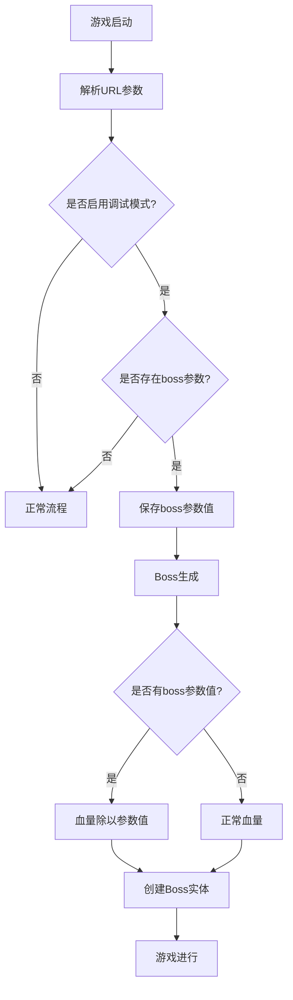

# 调试模式Boss血量配置设计文档

## 1. 需求概述

### 1.1 目标
实现调试模式下的Boss血量调整功能，通过URL参数`boss`控制Boss血量的除数倍率，便于测试和调试不同难度的Boss战。

### 1.2 背景
当前游戏已具备调试模式功能，通过URL参数`master=1&debug=1`启用。为了更好地支持游戏测试和平衡性调整，需要增加对Boss血量的动态调整能力。

## 2. 设计方案

### 2.1 功能描述
在调试模式下，当URL中包含`boss=N`参数时(N为正整数)，所有Boss的血量将被除以N，从而降低Boss的血量以便于测试。

### 2.2 实现机制

#### 2.2.1 参数解析
在游戏初始化阶段，扩展URL参数解析逻辑，增加对`boss`参数的识别和处理。

#### 2.2.2 血量调整
在Boss生成时，如果调试模式已启用且设置了`boss`参数，则将Boss的初始血量和最大血量除以该参数值。

### 2.3 核心流程



## 3. 技术实现

### 3.1 URL参数解析扩展
在`App.tsx`中的URL参数解析逻辑中增加对`boss`参数的处理：

```typescript
// 伪代码表示
const urlParams = new URLSearchParams(window.location.search);
const bossDivisor = parseInt(urlParams.get('boss')) || 1;
```

### 3.2 Boss血量调整实现
在`BossSystem.ts`的`spawn`方法中增加血量调整逻辑：

```typescript
// 伪代码表示
let hp = config.hp;
// 应用难度系统调整
if (this.difficultySys) {
  // ...难度调整逻辑
}

// 调试模式血量调整
if (GameConfig.debug && bossDivisor > 1) {
  hp = Math.max(1, Math.floor(hp / bossDivisor));
}
```

### 3.3 配置管理
在`game/config/game.ts`中添加调试参数存储：

```typescript
// 伪代码表示
export const GameConfig = {
  // ...现有配置
  debug: false,
  debugBossDivisor: 1,  // 新增Boss血量除数参数
};
```

## 4. 影响范围

### 4.1 涉及文件
- `/App.tsx` - URL参数解析逻辑
- `/game/config/game.ts` - 调试配置扩展
- `/game/systems/BossSystem.ts` - Boss生成和血量计算逻辑

### 4.2 兼容性考虑
- 不影响正常游戏流程
- 仅在调试模式下生效
- 参数值默认为1，不改变现有行为

## 5. 测试验证

### 5.1 测试场景
1. 未启用调试模式时，Boss血量正常
2. 启用调试模式但无`boss`参数时，Boss血量正常
3. 启用调试模式且`boss=2`时，Boss血量减半
4. 启用调试模式且`boss=10`时，Boss血量为原来的1/10

### 5.2 边界情况
- `boss`参数为0或负数时，应使用默认值1
- `boss`参数为非数字时，应使用默认值1
- 血量调整后结果小于1时，应设置为1以避免立即死亡

## 6. 使用示例

### 6.1 URL示例
```
# 正常游戏
http://localhost:3000/

# 调试模式
http://localhost:3000/?master=1&debug=1

# 调试模式，Boss血量减半
http://localhost:3000/?master=1&debug=1&boss=2

# 调试模式，Boss血量为原来的1/5
http://localhost:3000/?master=1&debug=1&boss=5

### 1.2 背景
当前游戏已具备调试模式功能，通过URL参数`master=1&debug=1`启用。为了更好地支持游戏测试和平衡性调整，需要增加对Boss血量的动态调整能力。

## 2. 设计方案

### 2.1 功能描述
在调试模式下，当URL中包含`boss=N`参数时(N为正整数)，所有Boss的血量将被除以N，从而降低Boss的血量以便于测试。

### 2.2 实现机制

#### 2.2.1 参数解析
在游戏初始化阶段，扩展URL参数解析逻辑，增加对`boss`参数的识别和处理。

#### 2.2.2 血量调整
在Boss生成时，如果调试模式已启用且设置了`boss`参数，则将Boss的初始血量和最大血量除以该参数值。

### 2.3 核心流程


## 3. 技术实现

### 3.1 URL参数解析扩展
在`App.tsx`中的URL参数解析逻辑中增加对`boss`参数的处理：

```typescript
// 伪代码表示
const urlParams = new URLSearchParams(window.location.search);
const bossDivisor = parseInt(urlParams.get('boss')) || 1;
```

### 3.2 Boss血量调整实现
在`BossSystem.ts`的`spawn`方法中增加血量调整逻辑：

```typescript
// 伪代码表示
let hp = config.hp;
// 应用难度系统调整
if (this.difficultySys) {
  // ...难度调整逻辑
}

// 调试模式血量调整
if (GameConfig.debug && bossDivisor > 1) {
  hp = Math.max(1, Math.floor(hp / bossDivisor));
}
```

### 3.3 配置管理
在`game/config/game.ts`中添加调试参数存储：

```typescript
// 伪代码表示
export const GameConfig = {
  // ...现有配置
  debug: false,
  debugBossDivisor: 1,  // 新增Boss血量除数参数
};
```

## 4. 影响范围

### 4.1 涉及文件
- `/App.tsx` - URL参数解析逻辑
- `/game/config/game.ts` - 调试配置扩展
- `/game/systems/BossSystem.ts` - Boss生成和血量计算逻辑

### 4.2 兼容性考虑
- 不影响正常游戏流程
- 仅在调试模式下生效
- 参数值默认为1，不改变现有行为

## 5. 测试验证

### 5.1 测试场景
1. 未启用调试模式时，Boss血量正常
2. 启用调试模式但无`boss`参数时，Boss血量正常
3. 启用调试模式且`boss=2`时，Boss血量减半
4. 启用调试模式且`boss=10`时，Boss血量为原来的1/10

### 5.2 边界情况
- `boss`参数为0或负数时，应使用默认值1
- `boss`参数为非数字时，应使用默认值1
- 血量调整后结果小于1时，应设置为1以避免立即死亡

## 6. 使用示例

### 6.1 URL示例
```
# 正常游戏
http://localhost:3000/

# 调试模式
http://localhost:3000/?master=1&debug=1

# 调试模式，Boss血量减半
http://localhost:3000/?master=1&debug=1&boss=2

# 调试模式，Boss血量为原来的1/5
http://localhost:3000/?master=1&debug=1&boss=5
```实现调试模式下的Boss血量调整功能，通过URL参数`boss`控制Boss血量的除数倍率，便于测试和调试不同难度的Boss战。
