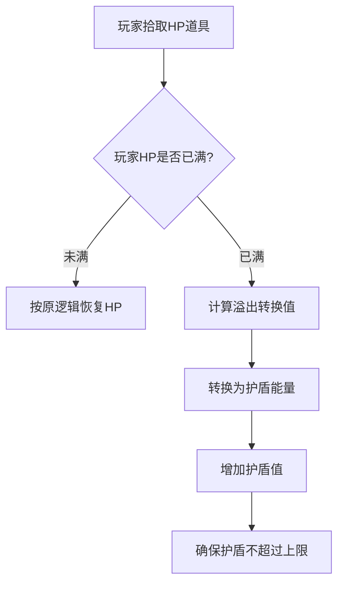

# 生命值溢出转换为护盾能量设计文档

## 1. 需求概述

### 1.1 目标
实现当玩家获取生命恢复道具时，若当前生命值已满，则将溢出的生命值转换为护盾能量，以增强玩家的生存能力。

### 1.2 背景
在当前的游戏机制中，当玩家生命值已满时拾取生命恢复道具，该道具的效果会被浪费。通过实现溢出转换机制，可以提升道具利用率，增强玩家体验。

## 2. 设计方案

### 2.1 核心逻辑
当玩家拾取生命恢复道具时：
1. 检查玩家当前生命值是否已满
2. 若未满，则按原有逻辑恢复生命值
3. 若已满，则将原本用于恢复生命值的能量转换为护盾能量进行补充

### 2.2 转换规则
- 转换比例：1:1（即原本能恢复多少生命值，就转换为等量的护盾能量）
- 护盾上限：遵循现有护盾上限规则，不会超过最大护盾值
- 优先级：生命值恢复优先于护盾转换（只有在生命值完全满时才触发转换）

### 2.3 实现细节

#### 2.3.1 修改点
主要修改 `GameEngine.ts` 中的 `applyPowerup` 方法中处理 `PowerupType.HP` 类型的部分。

#### 2.3.2 逻辑流程

## 3. 影响范围

### 3.1 游戏系统
- 道具系统：修改HP道具的应用逻辑
- 玩家状态系统：影响生命值和护盾值的更新机制

### 3.2 用户界面
无需修改UI，因为护盾值的显示已经实现，转换后会自动在UI上体现。

## 4. 配置参数

### 4.1 相关常量
- `hpRestoreAmount`: 单个HP道具恢复的生命值数量（来自 `PowerupEffects` 配置）
- 护盾上限由 `getShieldCap()` 方法动态计算得出

## 5. 测试要点

### 5.1 功能测试
1. 玩家生命值未满时拾取HP道具，验证正常恢复生命值
2. 玩家生命值已满时拾取HP道具，验证护盾值得到相应增加
3. 玩家生命值已满且护盾也已满时拾取HP道具，验证无异常

### 5.2 边界测试
1. 玩家生命值恰好等于最大值时拾取HP道具
2. 护盾值接近上限时进行转换，验证不会超出上限
3. 连续快速拾取多个HP道具，验证转换逻辑正确性