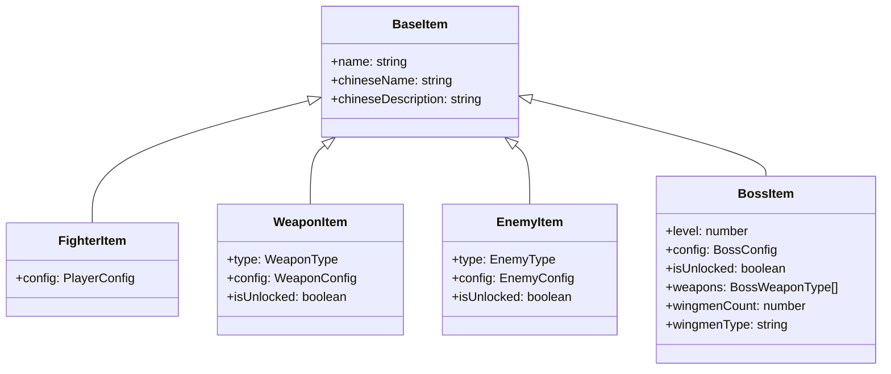
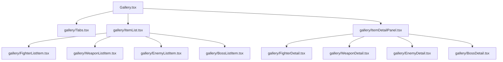
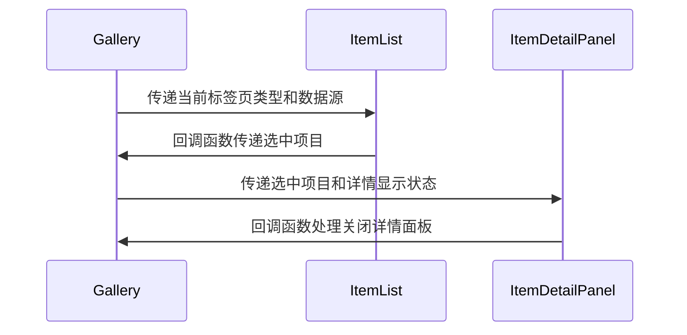

# HTML结构优化设计文档

## 1. 背景与问题分析

当前 Gallery 组件存在以下主要问题：

1. 单一文件过长，包含超过580行代码，难以维护
2. 数据渲染使用 `any` 类型，缺乏类型安全
3. 不同模块的详情显示逻辑混合在一起，耦合度高
4. 缺乏清晰的组件划分，违反高内聚低耦合原则

## 2. 设计目标

1. 将大型组件拆分为多个小型、专注的子组件
2. 为不同类型的数据定义明确的 TypeScript 接口
3. 实现高内聚、低耦合的组件架构
4. 保持现有功能不变的前提下提升可维护性

## 3. 解决方案概览

我们将采取以下措施来重构 Gallery 组件：

1. 创建专门的 TypeScript 接口来定义每种类型的数据结构
2. 将详情展示部分拆分为独立的组件
3. 将列表项渲染逻辑也拆分为独立组件
4. 主 Gallery 组件只负责状态管理和整体布局
5. 所有子组件放置在 gallery 子目录中以更好地组织代码

## 4. 详细设计方案

### 4.1 类型定义

首先，我们需要为不同类型的数据创建明确的 TypeScript 接口：

### 4.2 组件结构重组

我们将把 Gallery 组件拆分为以下几个独立组件，并放置在 `components/gallery` 子目录中：

#### 4.2.1 主组件 Gallery

主组件将保留以下职责：
- 管理活动标签页状态
- 处理选中项目状态
- 控制详情面板显示状态
- 提供数据源给子组件

#### 4.2.2 标签页组件 Tabs

独立的标签页组件将负责：
- 渲染标签页导航
- 处理标签页切换逻辑
- 移动端和桌面端的不同展示样式

#### 4.2.3 列表组件 ItemList

列表组件将根据当前激活的标签页类型动态渲染对应的列表项组件：
- FighterListItem
- WeaponListItem
- EnemyListItem
- BossListItem

每个列表项组件将：
- 接收特定类型的 props
- 处理自己的点击事件
- 应用相应的样式类

#### 4.2.4 详情面板组件 ItemDetailPanel

详情面板组件将根据当前选中的项目类型动态渲染对应的详情组件：
- FighterDetail
- WeaponDetail
- EnemyDetail
- BossDetail

每个详情组件将：
- 接收特定类型的 props
- 渲染该类型项目的详细信息
- 包含该类型特有的统计数据展示

### 4.3 数据流设计

## 5. 实施步骤

1. 创建 `components/gallery` 目录
2. 创建类型定义文件，定义所有需要的接口
3. 在 `gallery` 目录下创建独立的标签页组件
4. 为每种类型在 `gallery` 目录下创建列表项组件和详情组件
5. 重构主 Gallery 组件，移除直接的渲染逻辑
6. 更新导入路径以指向新的子组件位置
7. 更新样式引用，确保样式正确应用
8. 测试所有功能确保正常工作

## 6. 预期收益

1. **提高可维护性**：每个组件职责单一，易于理解和修改
2. **增强类型安全**：消除 `any` 类型，提供完整的类型检查
3. **改善开发体验**：组件拆分后更容易进行单元测试
4. **促进代码复用**：独立组件可以在其他地方重用