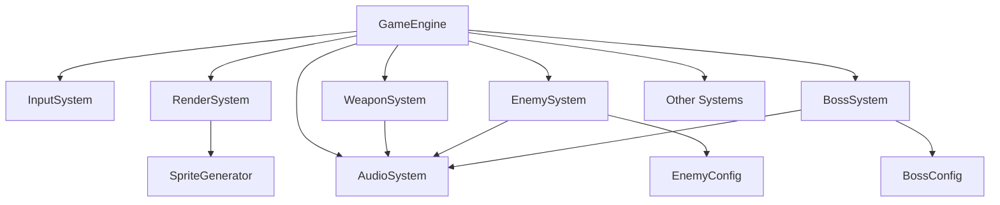

# 子系统自动化单元测试可行性评估

## 概述

本文档旨在评估为Neon Raiden游戏引擎中各个子系统实施自动化单元测试的可行性。通过对游戏架构和各子系统的分析，我们将确定哪些部分适合进行单元测试，以及可能面临的挑战。

## 游戏架构分析

### 核心组件

Neon Raiden采用基于组件的架构，主要包含以下核心系统：

1. **GameEngine** - 游戏主引擎，协调所有子系统
2. **InputSystem** - 处理用户输入
3. **RenderSystem** - 负责游戏画面渲染
4. **WeaponSystem** - 管理玩家武器逻辑
5. **EnemySystem** - 控制敌人生成和行为
6. **BossSystem** - 管理Boss战逻辑
7. **AudioSystem** - 处理音效
8. **辅助系统** - 包括ComboSystem、WeaponSynergySystem等

### 系统间依赖关系

## 各子系统测试可行性分析

### 1. InputSystem

#### 可测试性评估
- **优点**：
  - 逻辑相对简单，主要是按键状态管理
  - 输入处理函数较为独立
- **挑战**：
  - 需要模拟DOM事件
  - 依赖浏览器API，需要特殊处理

#### 推荐测试策略
- 模拟键盘事件，验证按键状态跟踪
- 测试触摸事件处理逻辑
- 验证回调函数正确触发

### 2. WeaponSystem

#### 可测试性评估
- **优点**：
  - 武器逻辑封装良好
  - 参数化设计便于测试不同武器类型
- **挑战**：
  - 依赖AudioSystem进行声音播放
  - 需要构造复杂的Entity对象

#### 推荐测试策略
- 验证不同武器类型的开火逻辑
- 测试武器升级对伤害和射击频率的影响
- Mock AudioSystem验证声音播放调用

### 3. EnemySystem

#### 可测试性评估
- **优点**：
  - 敌人类型和行为通过配置分离
  - 更新逻辑模块化
- **挑战**：
  - 需要大量Entity对象构造
  - 时间依赖性强（dt参数）

#### 推荐测试策略
- 验证不同类型敌人的生成权重
- 测试精英敌人属性加成计算
- 验证各种敌人AI行为逻辑

### 4. BossSystem

#### 可测试性评估
- **优点**：
  - Boss配置与逻辑分离
  - 移动模式模块化实现
- **挑战**：
  - 状态管理复杂
  - 大量时间依赖计算

#### 推荐测试策略
- 验证Boss生成位置计算
- 测试不同移动模式的实现
- 验证特殊机制（护盾再生、冲刺等）

### 5. RenderSystem

#### 可测试性评估
- **优点**：
  - 使用SpriteGenerator解耦图形资源
- **挑战**：
  - 强依赖Canvas API
  - 视觉效果难以量化验证

#### 推荐测试策略
- 主要进行集成测试而非单元测试
- 验证Entity绘制函数的基本逻辑
- 测试环境元素渲染

### 6. AudioSystem

#### 可测试性评估
- **优点**：
  - 音频生成功能独立
- **挑战**：
  - Web Audio API依赖
  - 声音播放效果主观性强

#### 推荐测试策略
- 验证音频上下文管理
- 测试不同音效的生成参数
- 验证播放状态控制

## 总体测试策略建议

### 测试框架选择
推荐使用Jest配合JSDOM进行单元测试，可以很好地模拟浏览器环境并提供丰富的断言功能。

### Mock策略
1. 对于外部依赖（Canvas API、Web Audio API），创建适当的Mock
2. 对于复杂对象（Entity），创建工厂函数简化测试数据构建
3. 对于时间相关逻辑，使用假定时器控制

### 测试重点排序
1. **高价值易测试**：WeaponSystem、EnemySystem核心逻辑
2. **中等价值可测试**：InputSystem、BossSystem
3. **低价值难测试**：RenderSystem、AudioSystem（主要进行集成测试）

## 预期挑战与解决方案

### 1. 时间依赖处理
- **问题**：游戏系统大量依赖时间差(dt)参数
- **解决方案**：使用固定时间步长进行测试，确保结果一致性

### 2. 复杂对象构造
- **问题**：Entity对象结构复杂，构造成本高
- **解决方案**：创建测试专用的工厂函数和辅助方法

### 3. 外部API依赖
- **问题**：Canvas和Audio API无法在Node环境中直接使用
- **解决方案**：使用JSDOM模拟DOM环境，对特定API进行Mock

### 4. 随机性因素
- **问题**：敌人生成、武器效果等包含随机因素
- **解决方案**：在测试中使用固定的随机种子或完全mock随机函数

## 实施计划建议

### 第一阶段（高优先级）
1. 为WeaponSystem编写单元测试
2. 为EnemySystem核心逻辑编写测试
3. 建立基础测试框架和Mock机制

### 第二阶段（中优先级）
1. 为InputSystem编写测试
2. 为BossSystem核心逻辑编写测试
3. 完善测试工具链

### 第三阶段（低优先级）
1. 为辅助系统编写测试
2. 补充边界条件和异常情况测试
3. 建立持续集成测试流程

## 结论

Neon Raiden项目具备良好的自动化单元测试实施基础。大部分核心系统具有清晰的接口和较低的耦合度，适合进行单元测试。建议从WeaponSystem和EnemySystem开始，逐步扩展到其他系统，在实施过程中建立完善的测试基础设施。
