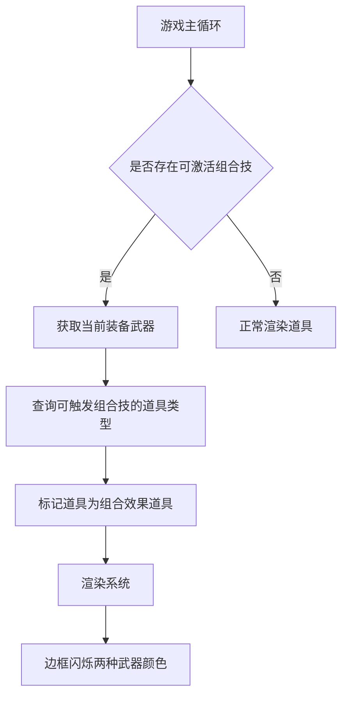

# 武器组合效果道具边框闪烁设计

## 需求概述

当玩家当前装备的武器存在可触发组合效果的道具时，这些道具在掉落时需要显示特殊的视觉效果，即边框闪烁两种武器的颜色，以提示玩家收集该道具可激活武器组合效果。

## 设计目标

1. 增强游戏视觉反馈，帮助玩家识别具有组合效果的道具
2. 提升游戏策略性，鼓励玩家收集特定道具以激活组合技
3. 保持视觉效果的性能和一致性

## 系统架构设计

### 核心组件

1. **WeaponSynergySystem** - 武器组合技系统
   - 负责检测武器组合关系
   - 提供组合技激活状态查询接口

2. **RenderSystem** - 渲染系统
   - 负责道具的视觉渲染
   - 实现边框闪烁效果

3. **PowerupVisuals** - 道具视觉配置
   - 定义道具的基础视觉属性
   - 扩展支持组合效果视觉标识

### 数据流设计



## 详细设计

### 1. 道具视觉配置扩展

在现有的 `PowerupVisualConfig` 接口基础上增加组合效果标识：

| 属性 | 类型 | 描述 |
|------|------|------|
| color | string | 道具基础边框颜色 |
| label | string | 显示标签 |
| isSynergyItem | boolean | 是否为组合效果道具标识 |
| synergyWeaponTypes | WeaponType[] | 关联的武器类型 |

### 2. 组合效果道具识别逻辑

#### 2.1 核心算法

1. 获取玩家当前装备的武器类型列表
2. 查询武器组合系统，获取所有可激活的组合技
3. 根据组合技配置，确定需要闪烁效果的道具类型
4. 为这些道具添加组合效果标识

#### 2.2 伪代码实现

```
function identifySynergyPowerups(equippedWeapons):
    // 获取所有可激活的组合技
    activeSynergies = synergySystem.getActiveSynergies()
    
    // 确定需要特殊渲染的道具类型
    synergyPowerupTypes = []
    for synergy in activeSynergies:
        for weaponType in synergy.requiredWeapons:
            if weaponType not in equippedWeapons:
                // 找到未装备但需要的武器类型
                powerupType = weaponTypeToPowerupType(weaponType)
                if powerupType:
                    synergyPowerupTypes.add(powerupType)
    
    return synergyPowerupTypes
```

### 3. 视觉渲染设计

#### 3.1 边框闪烁效果

1. **颜色混合**：使用两种武器的颜色进行交替闪烁
2. **闪烁频率**：每秒闪烁2次（500ms周期）
3. **透明度变化**：在闪烁过程中透明度在0.6-1.0之间变化

#### 3.2 渲染实现

```
function drawSynergyPowerup(powerupEntity, primaryColor, secondaryColor):
    // 计算闪烁效果
    time = getCurrentTime()
    flashPhase = (time % 500) / 500  // 0-1之间的值
    alpha = 0.6 + 0.4 * abs(0.5 - flashPhase) * 2  // 0.6-1.0范围
    
    // 确定当前应显示的颜色
    currentColor = (Math.floor(time / 250) % 2 === 0) ? primaryColor : secondaryColor
    
    // 绘制带闪烁效果的边框
    drawGlowingBorder(powerupEntity, currentColor, alpha)
```

### 4. 性能优化考虑

1. **缓存机制**：缓存已识别的组合效果道具类型，避免每帧重复计算
2. **视觉效果限制**：仅对屏幕内的道具应用闪烁效果
3. **时间戳检查**：使用时间戳机制避免不必要的重绘

## 接口设计

### 1. WeaponSynergySystem 扩展接口

```typescript
interface WeaponSynergySystem {
    /**
     * 获取与当前装备武器可组成组合技的道具类型
     * @param equippedWeapons 当前装备的武器列表
     * @returns 可触发组合效果的道具类型列表
     */
    getSynergyPowerupTypes(equippedWeapons: WeaponType[]): PowerupType[];
}
```

### 2. RenderSystem 扩展接口

```typescript
interface RenderSystem {
    /**
     * 绘制具有组合效果的道具
     * @param powerup 道具实体
     * @param primaryColor 主武器颜色
     * @param secondaryColor 副武器颜色
     */
    drawSynergyPowerup(powerup: Entity, primaryColor: string, secondaryColor: string): void;
}
```

## 配置管理

### 1. 视觉配置更新

在 `PowerupVisuals` 中为武器类道具添加组合效果标识：

```typescript
const PowerupVisuals: Record<PowerupType, PowerupVisualConfig> = {
    [PowerupType.VULCAN]: { 
        color: WeaponConfig[WeaponType.VULCAN].color, 
        label: 'V', 
        isSynergyItem: false,
        synergyWeaponTypes: []
    },
    // 其他道具配置...
};
```

### 2. 动态配置更新

当玩家装备武器发生变化时，需要更新道具的组合效果标识：

```
function updatePowerupSynergyMarkers(equippedWeapons):
    synergyPowerupTypes = synergySystem.getSynergyPowerupTypes(equippedWeapons)
    
    for powerupType in PowerupVisuals:
        visualConfig = PowerupVisuals[powerupType]
        if powerupType in synergyPowerupTypes:
            visualConfig.isSynergyItem = true
            // 获取关联的武器类型
            weaponType = powerupTypeToWeaponType(powerupType)
            synergy = synergySystem.getSynergyByWeapon(weaponType)
            visualConfig.synergyWeaponTypes = synergy.requiredWeapons
        else:
            visualConfig.isSynergyItem = false
            visualConfig.synergyWeaponTypes = []
```

## 测试验证方案

### 1. 单元测试

1. 测试 `getSynergyPowerupTypes` 方法正确识别可触发组合技的道具类型
2. 验证视觉配置更新逻辑正确性
3. 测试边界条件（无装备武器、无激活组合技等）

### 2. 集成测试

1. 验证游戏运行时道具边框闪烁效果正确显示
2. 测试不同组合技激活时的视觉效果差异
3. 检查性能影响，确保帧率稳定

### 3. 用户体验测试

1. 玩家是否能清晰识别具有组合效果的道具
2. 视觉效果是否足够吸引注意力但不过度干扰游戏
3. 颜色搭配是否符合视觉美学原则

## 风险评估与应对

### 1. 技术风险

**风险**：闪烁效果可能影响游戏性能
**应对**：
- 限制同时渲染的闪烁道具数量
- 使用requestAnimationFrame优化渲染时机
- 对低性能设备降低效果质量

### 2. 用户体验风险

**风险**：视觉效果过于显眼可能干扰游戏
**应对**：
- 提供视觉效果强度调节选项
- 控制闪烁频率和透明度范围
- 进行用户测试收集反馈

## 后续扩展性考虑

1. **更多视觉效果**：可扩展为边框旋转、粒子效果等
2. **音效配合**：为组合效果道具添加特殊音效
3. **个性化设置**：允许玩家自定义效果样式