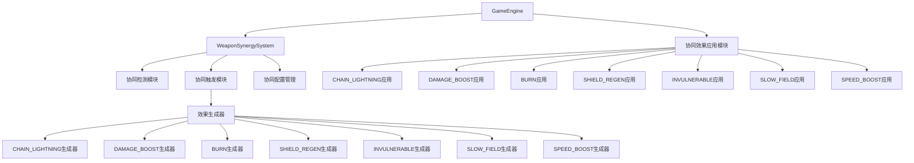
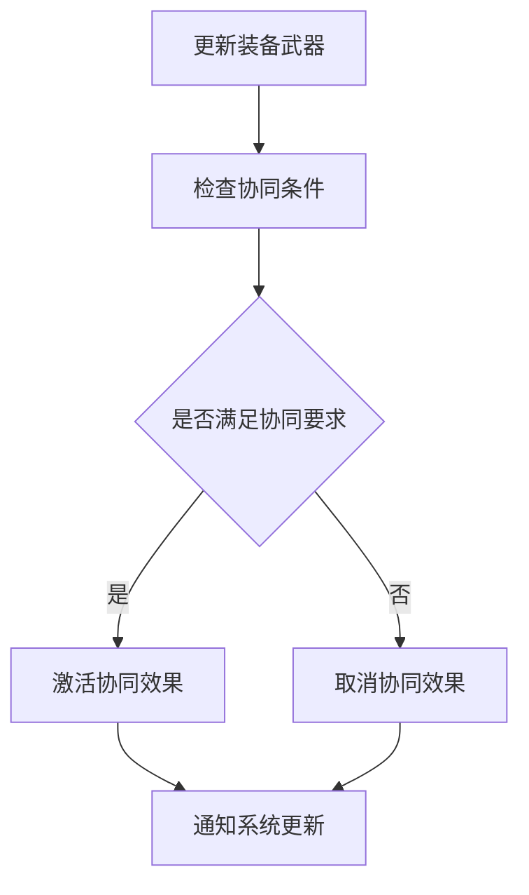
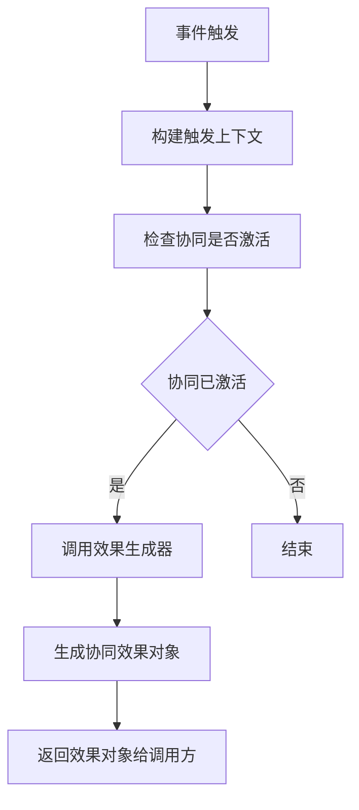
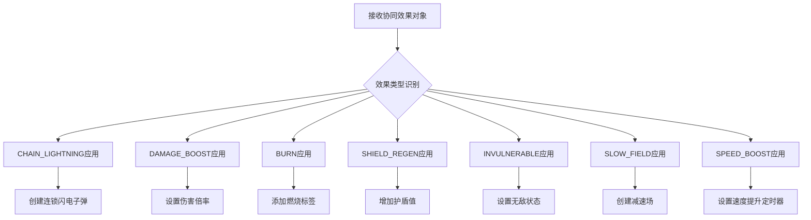

# 武器协同系统重构设计文档

## 1. 现状分析

### 1.1 问题概述
当前武器协同系统存在以下主要问题：
1. 功能实现分散在多个文件中，缺乏统一管理
2. 部分协同效果缺少完整实现（如SLOW_FIELD\SPEED_BOOST）
3. 部分效果缺少视觉效果，如BURN，应该要有燃烧或者类似效果
4. SynergyType和SynergyEffectType的定义区别
5. 缺少足够的注释说明，理解困难
6. 不相关的代码错误地放在实体移动逻辑中

### 1.2 当前架构分析
目前武器协同功能涉及的主要组件：

1. **WeaponSynergySystem.ts** - 核心协同逻辑系统
   - 定义协同类型枚举和配置
   - 管理激活状态和装备武器检测
   - 提供协同效果触发接口

2. **GameEngine.ts** - 协同效果应用层
   - 在子弹碰撞、爆炸、反弹等事件中调用协同系统
   - 应用协同效果到游戏实体
   - 部分协同逻辑错误放置在updateEntities方法中

### 1.3 协同效果类型分析
根据现有代码分析，系统支持以下协同效果类型：

| 效果类型 | 描述 | 是否完整实现 |
|---------|------|-------------|
| CHAIN_LIGHTNING | 连锁闪电 | 是 |
| DAMAGE_BOOST | 伤害加成 | 是 |
| BURN | 燃烧效果 | 是 |
| SHIELD_REGEN | 护盾回复 | 是 |
| INVULNERABLE | 无敌效果 | 是 |
| SLOW_FIELD | 减速场 | 否（仅有定义，无实际应用） |
| SPEED_BOOST | 速度提升 | 是 |

## 2. 设计目标

### 2.1 主要目标
1. **集中化管理** - 将所有协同相关逻辑整合到单一模块
2. **职责分离** - 明确区分协同检测、触发和应用的职责边界
3. **完善实现** - 补全缺失的协同效果实现（特别是SLOW_FIELD）
4. **提高可维护性** - 添加详细注释和文档说明
5. **优化性能** - 减少不必要的重复计算和调用

### 2.2 设计原则
1. **单一职责原则** - 每个函数只负责一个明确的功能
2. **开闭原则** - 易于添加新的协同效果类型而不修改现有代码
3. **依赖倒置原则** - 上层模块不依赖下层模块的具体实现
4. **接口隔离原则** - 提供清晰简洁的公共接口

## 3. 重构方案设计

### 3.1 新架构设计



### 3.2 模块职责划分

#### 3.2.1 WeaponSynergySystem (核心协调模块)
- 管理协同状态（激活/未激活）
- 维护装备武器列表
- 提供协同检测接口
- 协调各子模块工作流程

#### 3.2.2 协同检测模块
- 检查当前装备是否满足协同条件
- 判断协同是否已激活
- 提供协同可用性查询接口

#### 3.2.3 协同触发模块
- 接收触发事件（碰撞、爆炸、反弹等）
- 根据事件类型和武器类型判断是否触发协同
- 调用对应的效果生成器创建协同效果对象

#### 3.2.4 效果生成器模块族
- 每种协同效果对应一个独立的生成器
- 根据协同配置和触发上下文生成具体效果对象
- 支持扩展新的效果类型

#### 3.2.5 协同配置管理模块
- 管理所有协同类型的配置信息
- 提供配置查询接口
- 支持运行时配置更新

#### 3.2.6 协同效果应用模块族（位于GameEngine中）
- 接收协同效果对象
- 将效果应用到游戏实体
- 处理效果的生命周期管理
- 武器协同生效时，需要有视觉效果，如 BURN 应该在生效位置有燃烧或者合适的视觉效果

### 3.3 关键数据结构设计

#### 3.3.1 协同配置结构
```typescript
interface SynergyConfig {
  /** 组合技类型 */
  type: SynergyType;
  /** 组合技名称 */
  name: string;
  /** 组合技中文名 */
  chineseName: string;
  /** 需要的武器组合 */
  requiredWeapons: WeaponType[];
  /** 组合技描述 */
  description: string;
  /** 触发概率(0-1),1表示必定触发 */
  triggerChance: number;
  /** 效果颜色(用于视觉特效) */
  color: string;
}
```

#### 3.3.2 触发上下文结构
```typescript
interface SynergyTriggerContext {
  /** 当前武器类型 */
  weaponType: WeaponType;
  /** 子弹位置X */
  bulletX: number;
  /** 子弹位置Y */
  bulletY: number;
  /** 目标敌人 */
  targetEnemy: Entity;
  /** 所有敌人数组(用于生成连锁效果等) */
  enemies: Entity[];
  /** 玩家实体(用于计算位置等) */
  player: Entity;
  /** PLASMA爆炸区域 */
  plasmaExplosions?: { x: number; y: number; range: number }[];
  /** 事件类型 */
  eventType?: CombatEventType;
  /** SHURIKEN是否发生反弹 */
  shurikenBounced?: boolean;
}
```

#### 3.3.3 协同效果结果结构
```typescript
interface SynergyTriggerResult {
  /** 触发的组合技类型 */
  type: SynergyType;
  /** 效果类型 */
  effect: SynergyEffectType;
  /** 效果数值 */
  value: number;
  /** 效果颜色(用于视觉特效) */
  color: string;
  /** 伤害倍率(仅用于damage_boost效果) */
  multiplier?: number;
}
```

### 3.4 核心流程设计

#### 3.4.1 协同检测流程


#### 3.4.2 协同触发流程


#### 3.4.3 协同应用流程


## 4. 详细实现方案

### 4.1 WeaponSynergySystem 类重构

#### 4.1.1 类结构设计
```typescript
export class WeaponSynergySystem {
  // 私有属性
  private activeSynergies: Set<SynergyType>;
  private equippedWeapons: Set<WeaponType>;
  private synergyConfigs: Map<SynergyType, SynergyConfig>;
  
  // 构造函数
  constructor();
  
  // 公共接口
  reset(): void;
  updateEquippedWeapons(weapons: WeaponType[]): void;
  canCombine(w1: WeaponType, w2: WeaponType): boolean;
  getPotentialSynergyColors(weaponType: WeaponType): { colors: string[], synergyType: SynergyType } | null;
  isSynergyActive(type: SynergyType): boolean;
  getActiveSynergies(): SynergyConfig[];
  tryTriggerSynergies(context: SynergyTriggerContext): SynergyTriggerResult[];
  triggerPlasmaStorm(explosionX: number, explosionY: number, explosionRange: number, enemies: Entity[]): Entity[];
  
  // 私有方法
  private updateActiveSynergies(): void;
  private hasRequiredWeapons(required: WeaponType[]): boolean;
}
```

#### 4.1.2 核心方法实现要点

##### reset()
- 清空激活协同集合
- 清空装备武器集合
- 重置内部状态

##### updateEquippedWeapons()
- 更新装备武器列表
- 重新计算激活的协同效果
- 通知相关系统状态变更

##### tryTriggerSynergies()
- 根据触发上下文判断可触发的协同效果
- 生成对应的协同效果对象
- 返回效果列表供外部应用

### 4.2 SLOW_FIELD 效果补全实现

#### 4.2.1 问题分析
通过代码搜索发现，SynergyEffectType.SLOW_FIELD 已经在枚举中定义，但在 WeaponSynergySystem.ts 的 tryTriggerSynergies 方法中没有对应的处理逻辑，在 GameEngine.ts 中虽然有 slowFields 数组和相关处理代码，但没有协同系统为其提供数据。

#### 4.2.2 实现方案
1. 在 WeaponSynergySystem 中添加 SLOW_FIELD 效果生成逻辑
2. 确定合适的武器组合触发条件
3. 在 GameEngine 中完善 SLOW_FIELD 效果的应用逻辑

建议新增协同类型：
```typescript
[WAVE_MAGMA]: {
  type: SynergyType.WAVE_MAGMA,
  name: 'Glacial Wave',
  chineseName: '冰川波涌',
  requiredWeapons: [WeaponType.WAVE, WeaponType.MAGMA],
  description: 'WAVE与MAGMA结合产生减速场',
  triggerChance: 1.0,
  color: '#00ffff'
}
```

当 WAVE 子弹击中敌人时，有一定概率触发 SLOW_FIELD 效果，在子弹位置创建一个减速场。

### 4.3 代码组织结构调整

#### 4.3.1 文件结构调整
将原本分散在 GameEngine.ts 中的协同相关逻辑迁移至 WeaponSynergySystem.ts，使 GameEngine 只负责效果应用。

#### 4.3.2 方法职责调整
1. 将 updateEntities 中的 SHURIKEN 反弹协同处理移到 WeaponSynergySystem
2. 将 handleBulletHit 中的部分协同处理移到 WeaponSynergySystem
3. GameEngine 只保留效果应用相关代码

## 5. SynergyType和SynergyEffectType定义区别说明

### 5.1 SynergyType（协同类型）
SynergyType 定义了游戏中支持的武器协同组合类型，每种类型代表一种特定的武器组合及其触发条件。例如：
- LASER_TESLA：激光武器与特斯拉武器的组合
- WAVE_PLASMA：波纹武器与等离子武器的组合

每种协同类型都有其特定的配置信息，包括所需的武器组合、触发概率、效果颜色等。

### 5.2 SynergyEffectType（协同效果类型）
SynergyEffectType 定义了协同触发后产生的具体效果类型，每种效果类型代表一种具体的游戏机制变化。例如：
- CHAIN_LIGHTNING：连锁闪电效果
- DAMAGE_BOOST：伤害加成效果
- SLOW_FIELD：减速场效果

### 5.3 两者关系
SynergyType 和 SynergyEffectType 是一对多的关系：
- 一种协同类型（SynergyType）可以产生多种效果类型（SynergyEffectType）
- 多种协同类型可能产生相同的效果类型

例如，TESLA_PLASMA 协同类型可以同时产生 SHIELD_REGEN 和 INVULNERABLE 两种效果类型，而其他协同类型也可能单独产生其中一种效果。

## 6. 接口设计

### 6.1 WeaponSynergySystem 公共接口

#### 6.1.1 reset()
```typescript
/**
 * 重置组合技系统
 */
reset(): void;
```

#### 6.1.2 updateEquippedWeapons()
```typescript
/**
 * 更新玩家装备的武器列表
 * @param weapons 当前装备的武器列表
 */
updateEquippedWeapons(weapons: WeaponType[]): void;
```

#### 6.1.3 canCombine()
```typescript
/**
 * 检查两个武器是否可以组合成协同效果
 * @param w1 武器类型1
 * @param w2 武器类型2
 * @returns 是否可以组合
 */
canCombine(w1: WeaponType, w2: WeaponType): boolean;
```

#### 6.1.4 tryTriggerSynergies()
```typescript
/**
 * 尝试触发组合技效果
 * @param context 触发上下文
 * @returns 触发的组合技列表及其效果
 */
tryTriggerSynergies(context: SynergyTriggerContext): SynergyTriggerResult[];
```

### 6.2 数据结构接口

#### 6.2.1 SynergyConfig
```typescript
interface SynergyConfig {
  /** 组合技类型 */
  type: SynergyType;
  /** 组合技名称 */
  name: string;
  /** 组合技中文名 */
  chineseName: string;
  /** 需要的武器组合 */
  requiredWeapons: WeaponType[];
  /** 组合技描述 */
  description: string;
  /** 触发概率(0-1),1表示必定触发 */
  triggerChance: number;
  /** 效果颜色(用于视觉特效) */
  color: string;
}
```

#### 6.2.2 SynergyTriggerContext
```typescript
interface SynergyTriggerContext {
  /** 当前武器类型 */
  weaponType: WeaponType;
  /** 子弹位置X */
  bulletX: number;
  /** 子弹位置Y */
  bulletY: number;
  /** 目标敌人 */
  targetEnemy: Entity;
  /** 所有敌人数组(用于生成连锁效果等) */
  enemies: Entity[];
  /** 玩家实体(用于计算位置等) */
  player: Entity;
  /** PLASMA爆炸区域 */
  plasmaExplosions?: { x: number; y: number; range: number }[];
  /** 事件类型 */
  eventType?: CombatEventType;
  /** SHURIKEN是否发生反弹 */
  shurikenBounced?: boolean;
}
```

## 6. 测试验证方案

### 6.1 单元测试覆盖
1. 协同激活检测测试
2. 协同触发条件测试
3. 各种协同效果生成测试
4. 边界条件和异常情况测试

### 6.2 集成测试要点
1. 协同系统与游戏引擎的集成测试
2. 协同效果在游戏中的表现验证
3. 性能影响评估测试

## 7. 风险评估与应对措施

### 7.1 技术风险
1. **兼容性风险** - 修改可能影响现有功能
   - 应对措施：充分测试所有协同效果场景

2. **性能风险** - 集中处理可能增加单点负载
   - 应对措施：优化算法，避免不必要的重复计算

### 7.2 实施风险
1. **开发周期风险** - 重构工作量较大
   - 应对措施：分阶段实施，优先处理核心问题

2. **回归风险** - 修改可能引入新bug
   - 应对措施：完善的测试覆盖，逐步验证

## 8. 实施计划

### 8.1 第一阶段：基础重构
1. 整理 WeaponSynergySystem 类结构
2. 完善 SLOW_FIELD 效果实现
3. 迁移分散的协同逻辑

### 8.2 第二阶段：优化与完善
1. 添加详细注释和文档
2. 优化性能瓶颈
3. 完善错误处理机制

### 8.3 第三阶段：测试与验证
1. 单元测试补充
2. 集成测试执行
3. 性能基准测试

## 9. 验收标准

1. 所有协同效果正常工作且表现符合预期
2. 代码结构清晰，职责分明
3. 添加了充分的注释说明
4. 通过所有相关单元测试
5. 性能无明显下降